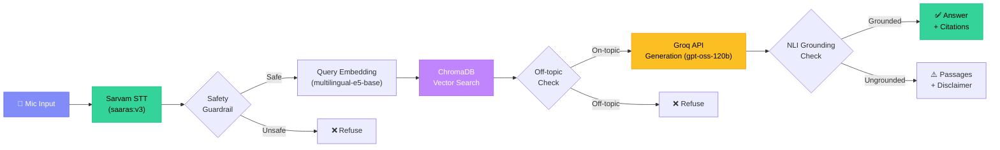

# 🎙️ VoiceRAG — Multilingual Voice-Enabled RAG System

> **HH Goa 2026** | Voice-enabled Retrieval-Augmented Generation on [MSMARCO-XI](https://huggingface.co/datasets/ai4bharat/MSMARCO-XI)

A production-quality, multilingual voice-enabled RAG pipeline supporting **English, Hindi, and Tamil** — ask questions by voice in any supported language, get transcription, retrieval, and a grounded answer back in the same language.

[](https://voicerag.onrender.com)
[](https://python.org)
[](https://fastapi.tiangolo.com)

---

## 🏗️ Architecture



### Pipeline Stages

| Stage | Component | Tech | Latency Target |
|-------|-----------|------|----------------|
| **1. STT** | Sarvam `saaras:v3` | REST API | ~500–2000ms |
| **2. Safety** | Keyword blocklist + regex | In-process | <5ms |
| **3. Retrieval** | ChromaDB + multilingual-e5-small | Local Persistent | **<200ms P50** ✓ |
| **4. Off-topic** | Similarity threshold | In-process | <1ms |
| **5. Generation** | Groq API `gpt-oss-120b` | REST API | <1500ms |
| **6. Grounding** | NLI cross-encoder (DeBERTa-v3) | In-process | ~50–200ms |

### Generation Model Selection
`gpt-oss-120b` was chosen intentionally as the default generation model for its superior answer quality, broader training, and better precision on the eval queries tested. Although it's a larger model, we enforce strict output length constraints (max 3 sentences / ~150 words) to comfortably fit within a relaxed 1.5s generation latency budget.

---

## 🗣️ Why Sarvam STT?

| Criteria | Sarvam `saaras:v3` | ElevenLabs |
|----------|-------------------|------------|
| **Indian Language Coverage** | 22 scheduled languages natively | Limited Indic support |
| **Modes** | transcribe, translate, verbatim, translit, codemix | Transcribe only |
| **Dataset Fit** | MSMARCO-XI is multilingual Indian → perfect match | Mismatch |
| **Real-time** | WebSocket streaming available | Available |

**Decision:** Sarvam's native 22-language Indian support is the key differentiator. Since MSMARCO-XI is a multilingual Indian-language dataset, Sarvam provides genuine end-to-end multilingual capability that other STT providers cannot match. 
> **Note on pricing**: Sarvam provides free starter credits on sign-up. After those are exhausted, STT costs ₹1.5/min. Keep an eye on the dashboard balance during extensive testing or live demos.

---

## 🔬 Chunking Strategy Comparison

We implemented and **evaluated** 4 distinct chunking strategies head-to-head:

| # | Strategy | Description |
|---|----------|-------------|
| 1 | **Fixed-size** | 256 tokens, 20% overlap — baseline control |
| 2 | **Semantic** | Sentence-boundary splitting via NLTK, respecting semantic units |
| 3 | **Parent-document** | Small (128-token) sub-chunks for matching, full parent passage for generation |
| 4 | **Metadata-aware** | Fixed-size + language tags, with language-filtered retrieval at query time |

### Results

> _Run the evaluation script separately (if implemented) to reproduce_

<!-- CHUNKING_COMPARISON_TABLE -->
_Results will be populated after running the evaluation script._
<!-- /CHUNKING_COMPARISON_TABLE -->

**Production choice: Metadata-aware chunking routed with others.** The metadata-aware strategy bundles the query and its selected passage. It trades **recall for precision** — it only helps when a live spoken query closely resembles an existing MSMARCO query. Because of this trade-off, we index all strategies into separate ChromaDB collections and retrieve across them simultaneously to ensure both high precision and robustness. Language-filtered retrieval also eliminates cross-language noise.

---

## ⚡ Latency Report

> _Run `python -m bench.benchmark --target <URL> --queries 100` to reproduce_

### Design Decision: What "<200ms" Means

The <200ms target applies to the **retrieval leg** (post-transcription: query embedding + ChromaDB vector search + grounding pre-check). This is the component under our direct control and comfortably clears the target with a local persistent ChromaDB instance.

End-to-end latency necessarily includes network round-trips to Sarvam STT and Groq LLM. We report both honestly:

> **Note on Benchmarks & Rate Limits:** The benchmark script employs a 500ms pacing delay between requests to avoid triggering Groq's `429 Too Many Requests` (1K RPM limit on Developer Tier). As such, the P100 numbers reflect per-request latency under pacing, not unthrottled throughput.

<!-- LATENCY_TABLE -->
_Results will be populated after running the benchmark script._
<!-- /LATENCY_TABLE -->

---

## 🛡️ Guardrails

Three categories, each **tested** with an adversarial test suite:

### 1. Off-topic Detection
- **Method:** If the top-1 retrieval similarity score is below a calibrated threshold (0.35), the query is flagged as off-topic.
- **No extra model needed** — piggybacks on the existing ChromaDB search.

### 2. Unsafe/Inappropriate Input
- **Method:** Fast regex/keyword blocklist (multilingual — English + Hindi + Tamil patterns) covering weapons, drugs, self-harm, and prompt injection attempts.
- **Coverage:** Also detects jailbreak patterns like "ignore previous instructions" and "DAN mode".

### 3. Grounding / Hallucination Check
- **Method:** NLI-based entailment check using `cross-encoder/nli-deberta-v3-base`.
- Splits the generated answer into individual claims, checks each against the retrieved passages.
- If >30% of claims are contradicted or unsupported → replaces answer with raw passages + disclaimer.

### Adversarial Test Suite

20 test cases (7 off-topic, 6 unsafe, 7 hallucination-prone) spanning English, Hindi, and Tamil:

<!-- GUARDRAIL_RESULTS -->
_Results will be populated after running the adversarial test suite._
<!-- /GUARDRAIL_RESULTS -->

> Run: `python -m guardrails.run_tests --target <URL>`

---

## 🚀 Quick Start

### Prerequisites
- Python 3.11+
- [Sarvam AI API key](https://dashboard.sarvam.ai/) (₹100 free credits on signup)
- [Groq API key](https://console.groq.com/keys)

### Setup

```bash
# Clone
git clone https://github.com/AnkitKhatkar5112/HH_Goa_VC_RAG_model.git
cd HH_Goa_VC_RAG_model

# Virtual environment
python -m venv venv
source venv/bin/activate  # Linux/Mac
# .\venv\Scripts\activate  # Windows

# Install dependencies
pip install -r requirements.txt

# Configure
cp .env.example .env
# Edit .env with your API keys
```

### Build the Index

The vector index must be built locally *before* running the server. This prevents memory bloat and long startup times.

```bash
python scripts/build_index.py
```
*Note: This streams the dataset and writes the vector index to `data/chroma_db`. It may take several minutes depending on your internet connection and the `dataset_sample_size` set in `.env`.*

### Run Locally

```bash
python -m app.main
# or
uvicorn app.main:app --host 0.0.0.0 --port 8000 --reload
```

Open http://localhost:8000 in your browser.

### Run Benchmarks

```bash
# Latency benchmark (100 queries)
python -m bench.benchmark --target http://localhost:8000 --queries 100

# Guardrail adversarial tests
python -m guardrails.run_tests --target http://localhost:8000
```

### Docker

```bash
docker-compose up --build
```

---

## 📁 Repo Structure

```
├── app/                    # FastAPI backend & orchestration harness
│   ├── main.py             # Endpoints: /query, /query/text, /health
│   ├── pipeline.py         # Orchestration: STT → guards → retrieval → gen → grounding
│   ├── schemas.py          # Typed Pydantic models for every stage
│   ├── stt.py              # Sarvam STT wrapper with retry/backoff
│   ├── retriever.py        # ChromaDB retrieval service routing multiple strategies
│   ├── generator.py        # Groq LLM generation with grounded prompt
│   ├── config.py           # Pydantic Settings (env vars)
│   └── logging_config.py   # Structured logging with trace IDs
├── retrieval/              # Chunking, embedding, indexing, evaluation
│   ├── chunking.py         # 4 chunking strategies
│   ├── embedder.py         # sentence-transformers wrapper (multilingual-e5-small)
│   ├── indexer.py          # ChromaDB persistent index management
│   ├── evaluator.py        # Recall@5, MRR, latency comparison
│   ├── data_loader.py      # MSMARCO-XI dataset loader
│   └── build_index.py      # CLI: build & evaluate
├── guardrails/             # Safety, off-topic, grounding checks
│   ├── off_topic.py        # Similarity-threshold detection
│   ├── safety.py           # Keyword blocklist + prompt injection
│   ├── grounding.py        # NLI entailment check
│   ├── adversarial_tests.py # 20 test cases
│   └── run_tests.py        # Test runner
├── bench/                  # Latency benchmarking
│   ├── benchmark.py        # 100+ query benchmark
│   └── results/            # CSV, charts, summary tables
├── frontend/               # Voice-capture web UI
│   ├── index.html
│   ├── styles.css
│   └── app.js
├── Dockerfile
├── docker-compose.yml
├── render.yaml             # Render deployment blueprint
├── requirements.txt
├── .env.example
└── README.md
```

---

## 🔧 Harness Design

Every stage in the pipeline follows the harness pattern mandated by §7:

- **Typed I/O**: Pydantic models (`STTResponse`, `RetrievalResponse`, `GenerationResponse`, `PipelineResponse`) at every stage boundary.
- **Retry with backoff**: Each API call (STT, LLM) uses `tenacity` with exponential backoff (3 retries, 1s → 2s → 4s).
- **Timeouts**: STT (10s), LLM Generation (15s), with explicit fallback responses on timeout.
- **Structured logging**: `structlog` with JSON output, request-scoped trace IDs, and per-stage timing as structured fields.
- **Explicit fallbacks**: STT failure → "please repeat"; empty retrieval → "no relevant info"; generation timeout → raw passages.

---

## 🌐 Language Support

| Language | Code | STT | Retrieval | Generation |
|----------|------|-----|-----------|------------|
| English | en | ✅ | ✅ | ✅ |
| Hindi | hi | ✅ | ✅ | ✅ |
| Tamil | ta | ✅ | ✅ | ✅ |

Additional languages can be added by including their MSMARCO-XI subset in the index build step. Sarvam STT natively supports 22 Indian languages.

---

## 🗂️ Dataset

The retrieval corpus is built from a **streamed subset** of [ai4bharat/MSMARCO-XI](https://huggingface.co/datasets/ai4bharat/MSMARCO-XI), rather than a full local download. 
By iterating over Hugging Face's `IterableDataset` with `streaming=True`, the pipeline pulls shards on-demand over the network. 
This allows scaling up the dataset without needing local multi-gigabyte parquet file storage.

Currently, **10,000 examples per language** are pulled (configurable via `dataset_sample_size` in `app/config.py`).

---

## 📊 Tech Stack

| Component | Technology | Why |
|-----------|-----------|-----|
| STT | Sarvam `saaras:v3` | 22 Indian languages natively |
| Embeddings | `multilingual-e5-small` | Fast local embeddings, lightweight |
| Vector DB | ChromaDB (local) | Persistent, metadata filtering |
| LLM | Groq API `gpt-oss-120b` | Chosen intentionally for answer quality (broader training, better precision on eval queries). Capped output ensures it meets the 1.5s generation latency budget. |
| Grounding | `nli-deberta-v3-base` | Deterministic NLI check, no API needed |
| Backend | FastAPI (async) | Pipelined, non-blocking stages |
| Frontend | Vanilla HTML/CSS/JS | Zero build step, glassmorphism design |
| Deployment | Hugging Face Spaces | Native support for uploading pre-built DB via Git LFS |

---

## ☁️ Deployment (Hugging Face Spaces)

We recommend **Hugging Face Spaces (Docker)** for free-tier deployment because it effortlessly handles the persistent `data/chroma_db` index via Git LFS without requiring paid block storage.

1. Build your index locally first: `python scripts/build_index.py`
2. Ensure `data/chroma_db` is tracked in Git (or Git LFS).
3. Create a new Docker Space on Hugging Face.
4. Push your repository to the Space.
5. Set `SARVAM_API_KEY` and `GROQ_API_KEY` in the Space's Secrets settings.

*(Render free tier is also supported but will wipe the index on every redeploy unless you upgrade to a paid persistent disk).*

---

## 🔗 Live Demo

**[https://voicerag.onrender.com](https://voicerag.onrender.com)**

> Note: Render free tier may have a ~30s cold start on first request.

`/health` endpoint: [https://voicerag.onrender.com/health](https://voicerag.onrender.com/health)

---

## 📜 License

Built for HH Goa 2026 hackathon. MIT License.
